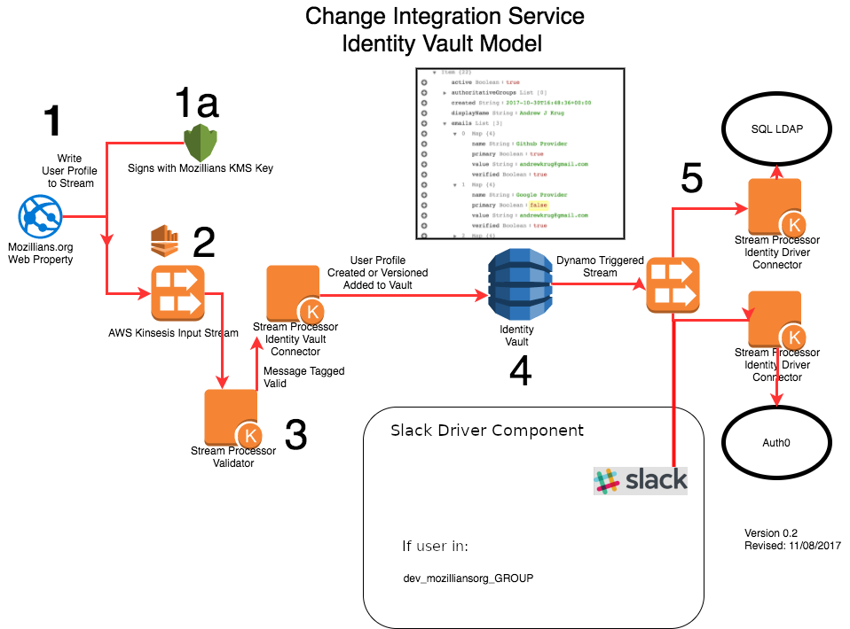

# Slack Driver

## About
This driver was created for the Mozilla IAM Project to satisfy an OKR around Slack user session expiration.

## Behavior

1. Spin up on cron/event trigger.
2. Scan the dynamodb table of all profiles.
3. Build a group data structure from all profiles.
4. Query the Slack API for all users profiles.
5. Fetch `apps.yml` access control file.
6. Disable any user without access to Slack through a Slack API call.
7. Enable any previously-disabled user that is still present in Slack database.

## Process Diagram


## Deployment

### Insert credstash api key

You only need to do this once.

```
credstash -r us-west-2 put -a slack-driver.token @slack-driver-api-key.txt app=slack-driver
```

### Deploy new code

```
docker run --rm -ti \
-v ~/.aws:/root/.aws -v `pwd`:/workspace \
mozillaiam/docker-sls:latest /bin/bash

npm i -g serverless
npm i -g serverless-python-requirements

sls deploy --stage dev --region us-west-2
```
